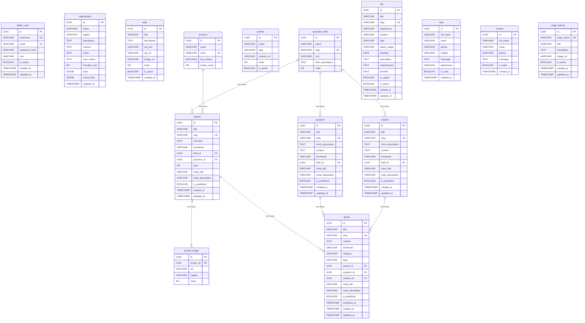

# VDCD Database — Table Descriptions (PostgreSQL 15+)

---

## admin_user

| No | Field | Data type | Constraints | Description |
| ---: | --- | --- | --- | --- |
| 1 | id | UUID | Primary Key, Not Null | Unique identifier for each admin |
| 2 | username | VARCHAR(100) | Not Null, Unique | Login username |
| 3 | email | VARCHAR(255) | Not Null, Unique | Login email |
| 4 | password_hash | VARCHAR(255) | Not Null | Hashed password |
| 5 | role | VARCHAR(50) | Not Null, Default: `editor` · CHECK (`superadmin`, `editor`, `viewer`) | Authorization role |
| 6 | is_active | BOOLEAN | Not Null, Default: TRUE | Account status |
| 7 | created_at | TIMESTAMP | Not Null, Default: NOW() | Account creation timestamp |
| 8 | updated_at | TIMESTAMP | Not Null, Default: NOW() | Last updated timestamp |

---

## organization

**Description:** Single-row config — stores VDCD organization information

| No | Field | Data type | Constraints | Description |
| ---: | --- | --- | --- | --- |
| 1 | id | UUID | Primary Key, Not Null | Unique identifier |
| 2 | name | VARCHAR(255) | Not Null | Full organization name |
| 3 | tagline | VARCHAR(255) | Nullable | Tagline / Slogan |
| 4 | description | TEXT | Nullable | Organization description (rich text) |
| 5 | mission | TEXT | Nullable | Mission |
| 6 | vision | TEXT | Nullable | Vision |
| 7 | core_values | TEXT | Nullable | Core values |
| 8 | founded_year | INT | Nullable | Year founded |
| 9 | stats | JSONB | Nullable | Statistics: `{ provinces, centers, projects, staff }` |
| 10 | social_links | JSONB | Nullable | Social networks: `{ facebook, zalo, youtube, ... }` |
| 11 | updated_at | TIMESTAMP | Not Null, Default: NOW() | Last updated timestamp |

---

## slide

**Description:** Manage homepage slideshow

| No | Field | Data type | Constraints | Description |
| ---: | --- | --- | --- | --- |
| 1 | id | UUID | Primary Key, Not Null | Unique identifier |
| 2 | title | VARCHAR(255) | Not Null | Slide title |
| 3 | description | TEXT | Nullable | Short description on slide |
| 4 | cta_text | VARCHAR(100) | Nullable | CTA button text (e.g.: "Learn more") |
| 5 | cta_url | VARCHAR(500) | Nullable | CTA button link |
| 6 | image_url | VARCHAR(500) | Not Null | Slide background image URL |
| 7 | order | INT | Not Null, Default: 0 | Display order |
| 8 | is_active | BOOLEAN | Not Null, Default: TRUE | Enable/disable slide |
| 9 | created_at | TIMESTAMP | Not Null, Default: NOW() | Creation timestamp |

---

## province

**Description:** List of Vietnamese provinces/cities used for the map

| No | Field | Data type | Constraints | Description |
| ---: | --- | --- | --- | --- |
| 1 | id | UUID | Primary Key, Not Null | Unique identifier |
| 2 | name | VARCHAR(100) | Not Null | Province/city name |
| 3 | code | VARCHAR(10) | Not Null, Unique | Standard Vietnamese province code (used to map with GeoJSON) |
| 4 | has_project | BOOLEAN | Not Null, Default: FALSE | Whether the province has any projects |
| 5 | center_count | INT | Not Null, Default: 0 | Number of centers/branches in the province |

---

## partner

**Description:** Clients & partners (logo display)

| No | Field | Data type | Constraints | Description |
| ---: | --- | --- | --- | --- |
| 1 | id | UUID | Primary Key, Not Null | Unique identifier |
| 2 | name | VARCHAR(255) | Not Null | Organization / company name |
| 3 | logo | VARCHAR(500) | Not Null | Logo URL (transparent background PNG) |
| 4 | website_url | VARCHAR(500) | Nullable | Partner website |
| 5 | order | INT | Not Null, Default: 0 | Display order |
| 6 | is_active | BOOLEAN | Not Null, Default: TRUE | Enable/disable display |

---

## operation_field

**Description:** Operation fields (used to categorize programs, solutions, projects)

| No | Field | Data type | Constraints | Description |
| ---: | --- | --- | --- | --- |
| 1 | id | UUID | Primary Key, Not Null | Unique identifier |
| 2 | name | VARCHAR(100) | Not Null | Field name (e.g.: Agriculture, Healthcare) |
| 3 | slug | VARCHAR(100) | Not Null, Unique | SEO-friendly URL slug |
| 4 | icon | VARCHAR(100) | Nullable | Representative icon |
| 5 | short_description | TEXT | Nullable | Short field description |
| 6 | order | INT | Not Null, Default: 0 | Display order |

---

## program

**Description:** Programs

| No | Field | Data type | Constraints | Description |
| ---: | --- | --- | --- | --- |
| 1 | id | UUID | Primary Key, Not Null | Unique identifier |
| 2 | title | VARCHAR(255) | Not Null | Program name |
| 3 | slug | VARCHAR(255) | Not Null, Unique | URL slug |
| 4 | short_description | TEXT | Nullable | Short description (displayed on list page) |
| 5 | content | TEXT | Nullable | Detailed content (rich text) |
| 6 | thumbnail | VARCHAR(500) | Nullable | Thumbnail image URL |
| 7 | field_id | UUID | Nullable, FK → `operation_field.id`, On Delete SET NULL | Associated operation field |
| 8 | meta_title | VARCHAR(60) | Nullable | SEO meta title (≤ 60 characters) |
| 9 | meta_description | VARCHAR(160) | Nullable | SEO meta description (≤ 160 characters) |
| 10 | is_published | BOOLEAN | Not Null, Default: FALSE | Published status |
| 11 | created_at | TIMESTAMP | Not Null, Default: NOW() | Creation timestamp |
| 12 | updated_at | TIMESTAMP | Not Null, Default: NOW() | Last updated timestamp |

---

## solution

**Description:** Solutions

| No | Field | Data type | Constraints | Description |
| ---: | --- | --- | --- | --- |
| 1 | id | UUID | Primary Key, Not Null | Unique identifier |
| 2 | title | VARCHAR(255) | Not Null | Solution name |
| 3 | slug | VARCHAR(255) | Not Null, Unique | URL slug |
| 4 | short_description | TEXT | Nullable | Short description (displayed on list page) |
| 5 | content | TEXT | Nullable | Detailed content (rich text) |
| 6 | thumbnail | VARCHAR(500) | Nullable | Thumbnail image URL |
| 7 | field_id | UUID | Nullable, FK → `operation_field.id`, On Delete SET NULL | Associated operation field |
| 8 | meta_title | VARCHAR(60) | Nullable | SEO meta title (≤ 60 characters) |
| 9 | meta_description | VARCHAR(160) | Nullable | SEO meta description (≤ 160 characters) |
| 10 | is_published | BOOLEAN | Not Null, Default: FALSE | Published status |
| 11 | created_at | TIMESTAMP | Not Null, Default: NOW() | Creation timestamp |
| 12 | updated_at | TIMESTAMP | Not Null, Default: NOW() | Last updated timestamp |

---

## project

**Description:** Projects

| No | Field | Data type | Constraints | Description |
| ---: | --- | --- | --- | --- |
| 1 | id | UUID | Primary Key, Not Null | Unique identifier |
| 2 | title | VARCHAR(255) | Not Null | Project name |
| 3 | slug | VARCHAR(255) | Not Null, Unique | URL slug |
| 4 | overview | TEXT | Nullable | Project overview (rich text) |
| 5 | thumbnail | VARCHAR(500) | Nullable | Thumbnail image URL |
| 6 | field_id | UUID | Nullable, FK → `operation_field.id`, On Delete SET NULL | Associated operation field |
| 7 | province_id | UUID | Nullable, FK → `province.id`, On Delete SET NULL | Implementation province/city |
| 8 | year | INT | Nullable | Project implementation year |
| 9 | meta_title | VARCHAR(60) | Nullable | SEO meta title (≤ 60 characters) |
| 10 | meta_description | VARCHAR(160) | Nullable | SEO meta description (≤ 160 characters) |
| 11 | is_published | BOOLEAN | Not Null, Default: FALSE | Published status |
| 12 | created_at | TIMESTAMP | Not Null, Default: NOW() | Creation timestamp |
| 13 | updated_at | TIMESTAMP | Not Null, Default: NOW() | Last updated timestamp |

---

## project_image

**Description:** Project gallery images

| No | Field | Data type | Constraints | Description |
| ---: | --- | --- | --- | --- |
| 1 | id | UUID | Primary Key, Not Null | Unique identifier |
| 2 | project_id | UUID | Not Null, FK → `project.id`, On Delete CASCADE | Project that owns this image |
| 3 | url | VARCHAR(500) | Not Null | Image URL |
| 4 | caption | VARCHAR(255) | Nullable | Image caption |
| 5 | order | INT | Not Null, Default: 0 | Order in gallery |

---

## article

**Description:** Articles / News (can be linked to projects, programs, or solutions for SEO purposes)

| No | Field | Data type | Constraints | Description |
| ---: | --- | --- | --- | --- |
| 1 | id | UUID | Primary Key, Not Null | Unique identifier |
| 2 | title | VARCHAR(255) | Not Null | Article title |
| 3 | slug | VARCHAR(255) | Not Null, Unique | URL slug |
| 4 | content | TEXT | Nullable | Full content (rich text) |
| 5 | thumbnail | VARCHAR(500) | Nullable | Thumbnail image URL |
| 6 | category | VARCHAR(100) | Nullable | Article category |
| 7 | tags | VARCHAR(500) | Nullable | Comma-separated tags |
| 8 | project_id | UUID | Nullable, FK → `project.id`, On Delete SET NULL | Linked to a project (SEO) |
| 9 | program_id | UUID | Nullable, FK → `program.id`, On Delete SET NULL | Linked to a program (SEO) |
| 10 | solution_id | UUID | Nullable, FK → `solution.id`, On Delete SET NULL | Linked to a solution (SEO) |
| 11 | meta_title | VARCHAR(60) | Nullable | SEO meta title (≤ 60 characters) |
| 12 | meta_description | VARCHAR(160) | Nullable | SEO meta description (≤ 160 characters) |
| 13 | is_published | BOOLEAN | Not Null, Default: FALSE | Published status |
| 14 | published_at | TIMESTAMP | Nullable | Official publication timestamp |
| 15 | created_at | TIMESTAMP | Not Null, Default: NOW() | Creation timestamp |
| 16 | updated_at | TIMESTAMP | Not Null, Default: NOW() | Last updated timestamp |

---

## job

**Description:** Job positions

| No | Field | Data type | Constraints | Description |
| ---: | --- | --- | --- | --- |
| 1 | id | UUID | Primary Key, Not Null | Unique identifier |
| 2 | title | VARCHAR(255) | Not Null | Job position title |
| 3 | slug | VARCHAR(255) | Not Null, Unique | URL slug |
| 4 | department | VARCHAR(100) | Nullable | Department / division |
| 5 | location | VARCHAR(255) | Nullable | Work location |
| 6 | type | VARCHAR(50) | Not Null, CHECK (`full-time`, `part-time`, `intern`) | Employment type |
| 7 | salary_range | VARCHAR(100) | Nullable | Salary range (e.g.: 10–15 million) |
| 8 | deadline | DATE | Nullable | Application deadline |
| 9 | description | TEXT | Nullable | Job description (rich text) |
| 10 | requirements | TEXT | Nullable | Candidate requirements (rich text) |
| 11 | benefits | TEXT | Nullable | Benefits (rich text) |
| 12 | is_urgent | BOOLEAN | Not Null, Default: FALSE | Display "Urgent" badge |
| 13 | is_active | BOOLEAN | Not Null, Default: TRUE | Enable/disable job position |
| 14 | created_at | TIMESTAMP | Not Null, Default: NOW() | Creation timestamp |
| 15 | updated_at | TIMESTAMP | Not Null, Default: NOW() | Last updated timestamp |

---

## lead

**Description:** Contact form submissions — managed by admin

| No | Field | Data type | Constraints | Description |
| ---: | --- | --- | --- | --- |
| 1 | id | UUID | Primary Key, Not Null | Unique identifier |
| 2 | full_name | VARCHAR(255) | Not Null | Contact person's full name |
| 3 | email | VARCHAR(255) | Not Null | Contact email |
| 4 | phone | VARCHAR(20) | Nullable | Phone number |
| 5 | subject | VARCHAR(255) | Nullable | Contact subject |
| 6 | message | TEXT | Nullable | Message content |
| 7 | attachment | VARCHAR(500) | Nullable | Attachment file URL (if any) |
| 8 | is_read | BOOLEAN | Not Null, Default: FALSE | Whether admin has read it |
| 9 | created_at | TIMESTAMP | Not Null, Default: NOW() | Form submission timestamp |

---

## page_banner

**Description:** Manage banners for specific pages

| No | Field | Data type | Constraints | Description |
| ---: | --- | --- | --- | --- |
| 1 | id | UUID | Primary Key, Not Null | Unique identifier |
| 2 | page_name | VARCHAR(100) | Not Null, Unique | The page where the banner is displayed (e.g., 'home', 'about') |
| 3 | title | VARCHAR(255) | Nullable | Banner title |
| 4 | description | TEXT | Nullable | Banner description |
| 5 | image_url | VARCHAR(500) | Not Null | Banner background image URL |
| 6 | is_active | BOOLEAN | Not Null, Default: TRUE | Enable/disable banner |
| 7 | created_at | TIMESTAMP | Not Null, Default: NOW() | Creation timestamp |
| 8 | updated_at | TIMESTAMP | Not Null, Default: NOW() | Last updated timestamp |

---

## contact

**Description:** General contact form submissions

| No | Field | Data type | Constraints | Description |
| ---: | --- | --- | --- | --- |
| 1 | id | UUID | Primary Key, Not Null | Unique identifier |
| 2 | full_name | VARCHAR(255) | Not Null | Contact person's full name |
| 3 | email | VARCHAR(255) | Not Null | Contact email |
| 4 | phone | VARCHAR(20) | Nullable | Phone number |
| 5 | message | TEXT | Not Null | Message content |
| 6 | is_read | BOOLEAN | Not Null, Default: FALSE | Whether admin has read it |
| 7 | created_at | TIMESTAMP | Not Null, Default: NOW() | Form submission timestamp |

---

# Indexes

| Index Name | Table | Column(s) | Description |
| --- | --- | --- | --- |
| `idx_program_slug` | program | slug | Fast program lookup by slug |
| `idx_program_field` | program | field_id | Filter programs by operation field |
| `idx_solution_slug` | solution | slug | Fast solution lookup by slug |
| `idx_solution_field` | solution | field_id | Filter solutions by operation field |
| `idx_project_slug` | project | slug | Fast project lookup by slug |
| `idx_project_field` | project | field_id | Filter projects by operation field |
| `idx_project_province` | project | province_id | Filter projects by province/city |
| `idx_project_year` | project | year | Filter projects by year |
| `idx_project_image_proj` | project_image | project_id | Query images by project |
| `idx_article_slug` | article | slug | Fast article lookup by slug |
| `idx_article_project` | article | project_id | Filter articles by project |
| `idx_article_program` | article | program_id | Filter articles by program |
| `idx_article_solution` | article | solution_id | Filter articles by solution |
| `idx_article_published` | article | published_at DESC | Sort articles by publication date |
| `idx_lead_created` | lead | created_at DESC | Sort leads by submission date |
| `idx_lead_is_read` | lead | is_read | Filter leads by read status |
| `idx_contact_created` | contact | created_at DESC | Sort contacts by submission date |
| `idx_contact_is_read` | contact | is_read | Filter contacts by read status |

---

# Entity Relationship Diagram

