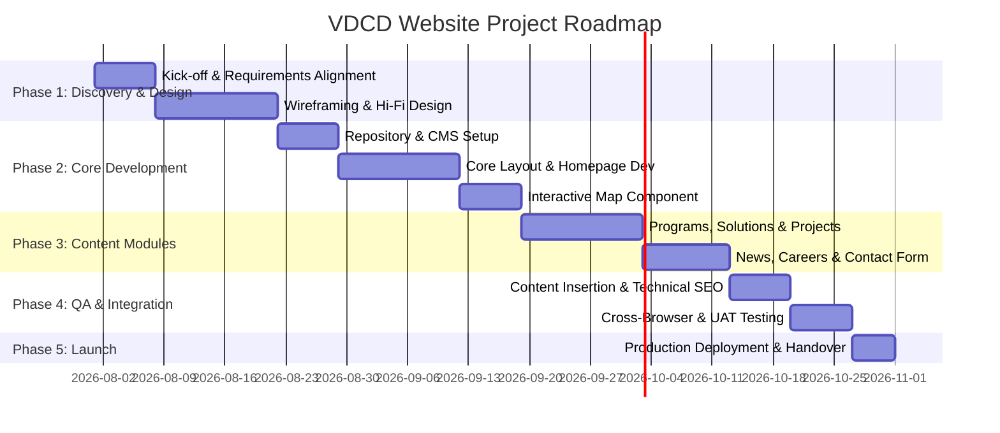

# VDCD Website Project Specification

**Version:** 1.0  
**Date:** 2026  
**Status:** Initial Draft  

---

## TABLE OF CONTENTS

1. [Project Overview](#1-project-overview)
2. [Target Audience](#2-target-audience)
3. [Sitemap & Page Structure](#3-sitemap--page-structure)
4. [Functional Requirements](#4-functional-requirements)
5. [Non-Functional Requirements](#5-non-functional-requirements)
6. [Content Requirements](#6-content-requirements)
7. [SEO Requirements](#7-seo-requirements)
8. [Design & UI/UX Requirements](#8-design--uiux-requirements)
9. [Proposed Tech Stack](#9-proposed-tech-stack)
10. [Data Model](#10-data-model)
11. [Content Handover Checklist](#11-content-handover-checklist)
12. [Development Roadmap](#12-development-roadmap)
13. [Open Questions](#13-open-questions)

---

## 1. PROJECT OVERVIEW

| Item | Details |
| --- | --- |
| **Project Name** | Gia Lai Innovation Center – Official Website / Landing Page |
| **Product Type** | Corporate Website + Conversion-Optimized Landing Page |
| **Scope** | 7 main page groups (see Sitemap) |
| **Platform** | Web (Responsive – Desktop & Mobile) |
| **Language** | Vietnamese (Primary); English extension ready |

### Short Summary
The Gia Lai Innovation Center is an organization operating in multiple strategic domains within the VDCD Group ecosystem, executing projects on a national scale. The website must showcase the scale and prestige of the center, clearly present capacity profiles, and optimize conversion for target audiences aged 30–50.

### Detailed Description
The Gia Lai Innovation Center serves as a bridge within the provincial innovation ecosystem, connecting Government Bodies, Enterprises, Startups, Industry Experts, and Investment Funds. With comprehensive capabilities in consulting, technology transfer, and deployment, the Center brings modern solutions into practical application for local socio-economic development.

---

## 2. TARGET AUDIENCE

### 2.1 Primary User Personas

#### Persona 1: Business Executives / Corporate Leaders
- **Age:** 35–50
- **Roles:** Directors, Department Heads, Business Owners
- **Goals:** Seek implementation partners, solution adoption, project collaboration
- **Needs:** Fast evaluation of capabilities, project portfolio, quick contact channels
- **Behavior:** Fast scanner, headline reader, prioritizes metrics & real-world project proof
- **Devices:** Desktop (60%), Mobile (40%)

#### Persona 2: Government Officials / Public Sector Specialists
- **Age:** 30–45
- **Goals:** Research state-backed programs, technical solutions, qualified implementation units
- **Needs:** Transparent capacity profile, detailed program schedules and guidelines
- **Behavior:** In-depth content consumption, document downloads
- **Devices:** Desktop (70%), Mobile (30%)

### 2.2 Persona-Driven Design Principles
- **No Over-decoration:** Serious, elegant, professional color palette
- **Jargon-Free Clarity:** Accessible language, avoiding obscure technical terms
- **Simplicity & Focus:** One clear primary Call-to-Action (CTA) per page
- **Trust Signals:** Key statistics, partner logos, verified project case studies, nationwide coverage maps

---

## 3. SITEMAP & PAGE STRUCTURE

```text
VDCD Website
│
├── / (Home)
├── /about-us (About Us)
├── /programs-solutions (Programs & Solutions)
│   ├── /programs (Program List)
│   │   └── /programs/:slug (Program Detail)
│   └── /solutions (Solution List)
│       └── /solutions/:slug (Solution Detail)
├── /projects (Projects)
│   └── /projects/:slug (Project Detail)
├── /news (News & Blog)
│   └── /news/:slug (Article Detail)
├── /careers (Careers / Recruitment)
│   └── /careers/:slug (Job Detail)
├── /contact (Contact Us)
└── /capacity-profile (Capacity Profile / Digital Brochure)
    └── /capacity-profile/:slug (Detail View)
```

---

## 4. FUNCTIONAL REQUIREMENTS

### 4.1 Home Page (`/`)

#### FR-HOME-01: Hero Slideshow
- Full-width image/video background carousel featuring key headlines and primary CTAs.
- Auto-play rotation with manual navigation controls (indicators and prev/next arrows).
- Each slide contains: Title, short description, call-to-action button.
- Fully responsive across mobile, tablet, and desktop viewports.

#### FR-HOME-02: Executive Summary
- Concise narrative section defining the role and strategic positioning of the Gia Lai Innovation Center.
- "View Capacity Profile" CTA button (opens digital brochure or downloadable PDF).

#### FR-HOME-03: Interactive Footprint Map
- Interactive map of Vietnam powered by SVG or map library (e.g., React Simple Maps / D3.js).
- Interactive markers highlighting provinces/cities with active or completed projects.
- Hover/click interaction displays an info tooltip (project count, local center details, key achievements).
- Adjacent metric counters displaying total provinces reached, active centers, and deployed projects.

#### FR-HOME-04: Featured Projects
- Card/grid layout organized by key operational domains.
- Each project card features: Thumbnail image, title, 1–2 line summary, location tag.
- Direct links routing to the corresponding Project Detail page.

#### FR-HOME-05: VDCD Group Ecosystem
- Grid or organizational diagram presenting member entities under the VDCD Group umbrella.

#### FR-HOME-06: Clients & Partners
- Logo showcase carousel/grid on the homepage.
- **Fixed logo strip embedded in the global footer** across all subpages.

---

### 4.2 About Us (`/about-us`)

#### FR-ABOUT-01: Hero Banner
- High-impact header image banner with page title and breadcrumb navigation.

#### FR-ABOUT-02: Detailed Narrative
- In-depth corporate introduction with rich media and visual callouts.
- Embedded CTA buttons redirecting visitors to Programs and Solutions pages.

#### FR-ABOUT-03: Mission – Vision – Core Values
- Structured 3-column layout or tabbed container.
- Each block includes: Custom icon + Title + Concise descriptive body text.

#### FR-ABOUT-04: Statistics & Branch Network Map
- Extended interactive map of Vietnam with detailed branch locations.
- Key figures counter: Total branches, active provinces, founding year, completed projects.
- Animated number increment counters triggered when scrolled into view.

#### FR-ABOUT-05: Operational Domains
- Comprehensive breakdown of operational fields and core technical competencies.

#### FR-ABOUT-07: Group Ecosystem Showcase
- Dedicated overview of member units within VDCD Group.

#### FR-ABOUT-08: Highlighted Projects
- Showcase of 3–6 key flagship projects with direct links to `/projects`.

---

### 4.3 Programs & Solutions (`/programs-solutions`)

#### FR-PG-01: Listing Directory
- Distinct tabs or sections separating **Programs** and **Solutions**.
- Each item card includes: Thumbnail image, title, brief abstract, "View Details" button.
- Multi-criteria filtering by industry sector or domain category.

#### FR-PG-02: Program / Solution Detail View
- Hero banner featuring title and high-resolution thumbnail.
- Rich-text editor body content (supporting headings, lists, inline images, tables).
- **SEO Article Mechanism:** Section for "Related Articles" or an "Additional Information" tab allowing administrators to link blog posts for targeted SEO keyword ranking.
- Call-to-Action blocks: "Request Consultation" / "Download Documentation".
- Carousel of related programs or solutions.

---

### 4.4 Projects (`/projects`)

#### FR-PRJ-01: Project Directory
- Filterable grid/list layout of completed and ongoing projects.
- Filters: Operational Sector, Geographic Location (Province/City), Year of Implementation.
- Project Card elements: Cover photo, project title, province location, domain, short summary.

#### FR-PRJ-02: Project Detail View
- **Header Block:** Banner visual + project name + key metadata summary (Location, Duration, Domain, Client).
- **Project Overview:** Rich-text description, technical specs table, quantifiable outcomes.
- **Media Gallery:** Image lightbox grid with photo zoom and video playback support.
- **Related Projects:** Cards presenting 3 contextually relevant projects.
- **SEO Article Mechanism:** Identical to Program/Solution pages for long-tail keyword optimization.

---

### 4.5 News & Blog (`/news`)

#### FR-NEWS-01: News Directory
- Header banner summarizing news topics and announcements.
- Article card grid: Thumbnail image, title, published date, summary excerpt, category tag.
- Pagination controls or infinite scroll loading.
- Filtering by category and tags.

#### FR-NEWS-02: Article Detail View
- Post title, publication date, author attribution, category tag.
- Rich-text body content with embedded media support.
- Social sharing shortcuts (Facebook, Zalo, Twitter/X, LinkedIn, Copy Link).
- Recommended related articles widget.
- Breadcrumb navigation path.

---

### 4.6 Careers / Recruitment (`/careers`)

#### FR-JOB-01: Job Board Directory
- Keyword search bar.
- Multi-select filters: Department, Location, Employment Type (Full-time / Part-time / Internship).
- Job Card elements: Position title, department, work location, date posted, application deadline, status badges (*New*, *Urgent*).
- Pagination controls.

#### FR-JOB-02: Job Detail View
- Position title, summary card (Salary range, Work location, Deadline, Openings).
- Detailed Job Description (JD).
- Candidate Requirements.
- Compensation & Benefits.
- Quick Application Modal/Form (Name, Email, Phone Number, Resume upload) or direct mailto link.
- List of related open job postings.

---

### 4.7 Contact (`/contact`)

#### FR-CONTACT-01: Contact Landing Page
- Organization details: Office address, Hotline numbers, Official email addresses, Operating hours.
- Embedded Google Maps widget.
- Links to official social media channels.

#### FR-CONTACT-02: Lead Generation Form
- Fields: Full Name (*), Email Address (*), Phone Number (*), Subject, Message, File Attachment (Optional).
- Client-side validation + server-side schema verification.
- Success confirmation banner/toast notification.
- Automatic email notifications sent to admin upon submission.
- Anti-spam protection (reCAPTCHA v3 or Honeypot mechanism).

---

### 4.8 Global Features

#### FR-GLOBAL-01: Header Navigation
- VDCD official logo.
- Main navigation bar (supporting multi-level dropdowns / mega menu).
- Highlighted CTA buttons: "Contact Now" / "Capacity Profile".
- Sticky header transition on page scroll down.

#### FR-GLOBAL-02: Footer
- Brand logo + tagline.
- Secondary sitemap links.
- Official contact details & social channels.
- **Client & Partner Logo Strip** (Fixed at footer on all pages except Homepage).
- Copyright notice.

#### FR-GLOBAL-03: Capacity Profile Access
- Downloadable PDF version.
- Standalone digital interactive web brochure.
- Event tracking for total downloads.

#### FR-GLOBAL-04: Content Management System (CMS)
- Content CRUD management: Programs, Solutions, Projects, News, Careers.
- Client & Partner logo manager.
- Key statistical metrics manager (Home & About Us pages).
- Historical timeline manager.
- Interactive map location data manager (provinces, centers).
- Lead submission dashboard with CSV export functionality.

---

## 5. NON-FUNCTIONAL REQUIREMENTS

| Category | Requirement Specification |
| --- | --- |
| **Performance** | Google PageSpeed Insights score ≥ 85 (Mobile) and ≥ 90 (Desktop) |
| **Page Loading Speed** | Largest Contentful Paint (LCP) ≤ 2.5s over standard 4G connections |
| **Responsiveness** | Optimized for Mobile (≥ 375px), Tablet (768px), and Desktop (1280px+) |
| **Browser Compatibility** | Chrome, Firefox, Safari, Edge – latest 2 major versions |
| **On-Page SEO** | Dynamic Meta title/description, Open Graph tags, Schema.org JSON-LD, sitemap.xml, robots.txt |
| **Security** | Mandatory HTTPS, XSS prevention, CSRF protection on forms, rate limiting |
| **Uptime** | ≥ 99.5% operational availability |
| **Scalability** | Modular architecture supporting new sections without refactoring core components |
| **Accessibility** | WCAG 2.1 AA compliance (proper image alt texts, ARIA labels, visual contrast ratio) |

---

## 6. CONTENT REQUIREMENTS

### 6.1 Client-Provided Assets & Information

#### A. Organizational Data
- [ ] Full legal name, official abbreviation, logo assets (SVG + transparent PNG)
- [ ] Official tagline / slogan
- [ ] Company background story (500–1000 words)
- [ ] Mission, Vision, and Core Values statements
- [ ] Historical milestones (year-by-year timeline)
- [ ] Official contact details: Physical addresses, hotlines, emails, operating hours
- [ ] Links to official social media accounts

#### B. Statistical Data
- [ ] Number of provinces with active deployments
- [ ] Number of innovation centers / branch offices
- [ ] Total completed projects counter
- [ ] Official founding year
- [ ] Total workforce count (optional)

#### C. Operational Sectors
- [ ] List of operational sectors (titles, brief descriptions, custom icon recommendations)

#### D. VDCD Group Ecosystem
- [ ] Entity names and logo files for each member unit
- [ ] Short summary for each unit
- [ ] Unit website URLs (where applicable)

#### E. Programs & Solutions
- [ ] Program directory (titles, abstracts, cover images)
- [ ] Solution directory (titles, abstracts, cover images)
- [ ] In-depth content write-ups for each program and solution

#### F. Projects
- [ ] Project list (minimum 10 projects for initial map and gallery population)
- [ ] Per project data: Name, province/city, sector, year, rich text description, media gallery (≥ 5 photos per project)

#### G. Clients & Partners
- [ ] High-resolution logo assets (Transparent PNG, minimum 200x100px)
- [ ] Official organization / enterprise names

#### H. Capacity Profile
- [ ] Capacity Profile PDF file (or raw content for digital design)

#### I. Recruitment (If launching at soft launch)
- [ ] Open position listings and Job Descriptions (JDs)

#### J. Media Assets
- [ ] Hero slideshow media (≥ 5 high-res photos/videos, 16:9 ratio, ≥ 1920x1080px)
- [ ] Office space & facility photography
- [ ] Team & leadership photography (optional)
- [ ] High-quality project field photos and videos

---

### 6.2 Technical Team Content Preparation
- [ ] Template SEO content structure for Project detail pages
- [ ] Template SEO content structure for Program / Solution detail pages
- [ ] Professional boilerplate placeholder content for design and prototype development

---

## 7. SEO REQUIREMENTS

### 7.1 Technical SEO Architecture
- **Human-Readable URLs:** `/about-us`, `/projects/project-slug`, `/news/article-slug`
- **Meta Tags Management:** Configurable Meta Title (≤ 60 chars) and Meta Description (≤ 160 chars) via CMS.
- **Open Graph Metadata:** Custom `og:title`, `og:description`, `og:image` for social sharing per page.
- **Schema.org Structured Data:** `Organization`, `BreadcrumbList`, `Article` (News), `JobPosting` (Careers).
- **Automated XML Sitemap:** Auto-generated and updated upon publishing new content.
- **Canonical Tags:** Self-referential canonical tags to prevent duplicate content indexing.
- **Robots.txt:** Configured with proper crawler directives.
- **Asset Optimization:** Next.js Image component lazy loading, WebP format conversion, JS/CSS minification, static asset caching.

### 7.2 SEO Content Engine for Projects, Programs & Solutions
**Objective:** Enable CMS administrators to attach multiple blog articles to any Project, Program, or Solution detail page to:
- Target high-intent long-tail keywords.
- Increase text density for search engine crawlers.
- Build relevant internal linking structures.

**Implementation Strategy:**
- Each detail page features a dedicated section: *"Articles related to [Project / Solution Name]"*.
- Admins can publish or select existing blog articles in the CMS and tag them to target pages.
- Associated articles also display on the main `/news` listing with matching category tags.
- Article canonical URL: `/news/article-slug`, embedded contextually inside the detail page.

### 7.3 Target Keyword Strategy Direction
- `[Domain Name] + [Province / City]`
- `[Program / Solution Name] + consulting / deployment`
- `VDCD + [Operational Field]`
- `[Sector] projects in [Province]`

---

## 8. DESIGN & UI/UX REQUIREMENTS

### 8.1 Visual Aesthetic Guidelines
- **Color Palette:** Professional, corporate, authoritative – avoiding overly flashy colors.
  - *Primary Recommendation:* Navy Blue + Clean White + Slate/Light Gray accents (To be confirmed with client brand guidelines).
- **Typography:** Modern, highly legible sans-serif typefaces (e.g., *Inter*, *Be Vietnam Pro*).
- **Layout & Structure:** Clean grid alignment, generous whitespace, breathing space between sections.
- **Imagery Standard:** High-resolution real-world media; strict prohibition of generic stock imagery.

### 8.2 UX Engineering Principles
- **Focused Conversion:** Exactly **one primary CTA** highlighted per viewport fold.
- **Intuitive Navigation:** Clear hierarchy with breadcrumb trails on all subpages.
- **Streamlined Forms:** Maximum of 5 required fields on contact forms.
- **Touch-Optimized Map:** Fully touch-friendly interactive map controls for mobile users.
- **UI State Indicators:** Smooth loading skeletons and spinners for maps, forms, and galleries.

### 8.3 Design Deliverables
- [ ] Low-fidelity (Lo-Fi) Wireframes for all 7 primary page groups.
- [ ] High-fidelity (Hi-Fi) Mockups (Desktop & Mobile viewports) for: Homepage, About Us, Project Detail, Contact Us.
- [ ] Comprehensive Design System / Style Guide: Color tokens, typography scale, UI component library.
- [ ] Interactive Figma prototype.

---

## 9. PROPOSED TECH STACK

> *Note: Recommended architecture subject to final confirmation based on team engineering capacity.*

### Next.js + NestJS Architecture (Recommended)

| Architectural Layer | Technology Selection |
| --- | --- |
| **Frontend Framework** | Next.js (React) + TypeScript |
| **UI Styling** | Tailwind CSS |
| **Backend Framework** | NestJS |
| **Database** | PostgreSQL |
| **Vietnam Map Render** | React Simple Maps / D3.js + Vietnam GeoJSON |
| **Lightbox Gallery** | Yet Another React Lightbox |
| **Form Handling** | React Hook Form + Nodemailer |
| **Deployment** | Vercel (Frontend) + Cloud VPS / DigitalOcean (CMS & API) |
| **CDN & DNS** | Cloudflare |

---

## 10. DATA MODEL

### Core Entities & Field Schemas

```typescript
// Organization Profile
interface Organization {
  id: string;
  name: string;
  tagline: string;
  description: string; // Rich Text
  mission: string;
  vision: string;
  coreValues: string[];
  foundedYear: number;
  stats: {
    provincesCount: number;
    centersCount: number;
    projectsCount: number;
    [key: string]: number;
  };
  socialLinks: { platform: string; url: string }[];
}

// Operational Domain
interface OperationField {
  id: string;
  name: string;
  slug: string;
  icon: string;
  shortDescription: string;
  displayOrder: number;
}

// VDCD Ecosystem Member
interface EcosystemMember {
  id: string;
  name: string;
  logoUrl: string;
  description: string;
  websiteUrl?: string;
  displayOrder: number;
}

// History Milestone
interface HistoryMilestone {
  id: string;
  year: number;
  title: string;
  description: string;
  imageUrl?: string;
}

// Province / Location
interface Province {
  id: string;
  name: string;
  code: string; // Official VN Province Code
  hasProject: boolean;
  centerCount: number;
}

// Program Entity
interface Program {
  id: string;
  title: string;
  slug: string;
  thumbnailUrl: string;
  shortDescription: string;
  content: string; // Rich Text
  fieldId: string; // -> OperationField
  relatedArticles?: string[]; // -> Article IDs
  seo: {
    metaTitle: string;
    metaDescription: string;
    ogImage?: string;
  };
}

// Solution Entity
interface Solution {
  id: string;
  title: string;
  slug: string;
  thumbnailUrl: string;
  shortDescription: string;
  content: string; // Rich Text
  fieldId: string; // -> OperationField
  relatedArticles?: string[]; // -> Article IDs
  seo: {
    metaTitle: string;
    metaDescription: string;
    ogImage?: string;
  };
}

// Project Entity
interface Project {
  id: string;
  title: string;
  slug: string;
  thumbnailUrl: string;
  provinceId: string; // -> Province
  fieldId: string; // -> OperationField
  year: number;
  overview: string; // Rich Text
  galleryImages: string[];
  relatedArticles?: string[]; // -> Article IDs
  seo: {
    metaTitle: string;
    metaDescription: string;
    ogImage?: string;
  };
}

// Article / News Entity
interface Article {
  id: string;
  title: string;
  slug: string;
  thumbnailUrl: string;
  category: string;
  tags: string[];
  content: string; // Rich Text
  publishedAt: Date;
  authorName?: string;
  relatedProjectId?: string;
  relatedProgramId?: string;
  relatedSolutionId?: string;
  seo: {
    metaTitle: string;
    metaDescription: string;
    ogImage?: string;
  };
}

// Job Position Entity
interface Job {
  id: string;
  title: string;
  slug: string;
  department: string;
  location: string;
  type: 'full-time' | 'part-time' | 'internship';
  salaryRange?: string;
  deadline: Date;
  description: string; // Rich Text
  requirements: string; // Rich Text
  benefits: string; // Rich Text
  isUrgent: boolean;
  isActive: boolean;
}

// Client & Partner Entity
interface Partner {
  id: string;
  name: string;
  logoUrl: string;
  websiteUrl?: string;
  displayOrder: number;
}

// Form Lead Submission
interface Lead {
  id: string;
  fullName: string;
  email: string;
  phone: string;
  subject?: string;
  message: string;
  attachmentUrl?: string;
  createdAt: Date;
}
```

---

## 11. CONTENT HANDOVER CHECKLIST

### Client Responsibilities (VDCD Group)

#### High Priority (Required Prior to Design Phase)
- [ ] Master Vector Logo Files (AI/SVG + PNG with white background + PNG transparent)
- [ ] Brand Color Specifications (HEX Color Codes)
- [ ] Official Tagline & Motto
- [ ] 5–10 high-resolution hero banner visuals
- [ ] Verified statistical numbers & operational metrics
- [ ] Complete list of operational sectors

#### Medium Priority (Required Prior to Development Phase)
- [ ] Written corporate background statement
- [ ] Mission, Vision, and Core Values texts
- [ ] Milestone timeline data
- [ ] VDCD Ecosystem member assets and summaries
- [ ] Content for 3–5 initial Programs and Solutions
- [ ] Data & media for 10–20 completed projects
- [ ] Vector/PNG logos for 10–20 major client & partner organizations
- [ ] Official Capacity Profile PDF

#### Low Priority (Can be Populated Post-Launch)
- [ ] Initial news articles and press releases
- [ ] Active career opportunities
- [ ] Detailed SEO articles linked to projects/solutions

---

## 12. DEVELOPMENT ROADMAP



### Phase 1 – Discovery & Design (2–3 Weeks)
- [ ] Kick-off alignment meeting to resolve Open Questions.
- [ ] Batch 1 content collection from client team.
- [ ] Lo-Fi wireframe sign-off for all 7 page groups.
- [ ] Hi-Fi UI design for Homepage, About Us, Project Detail, and Contact Us.
- [ ] Client design review and formal approval.

### Phase 2 – Infrastructure & Core Development (3–4 Weeks)
- [ ] Project repository initialization, CI/CD pipeline, dev/staging environments setup.
- [ ] CMS initialization and data schema definitions.
- [ ] Shell layout development (Header, Footer, Navigation, Drawer).
- [ ] Homepage section engineering.
- [ ] About Us section engineering.
- [ ] Interactive Vietnam map component integration.

### Phase 3 – Content Modules Development (3–4 Weeks)
- [ ] Programs & Solutions directory and detail view pages.
- [ ] Projects directory, detail view, and media lightbox gallery.
- [ ] News / Blog module.
- [ ] Careers module.
- [ ] Contact landing page with lead submission form.

### Phase 4 – Integration, Optimization & Testing (1–2 Weeks)
- [ ] Real-world content insertion from client assets.
- [ ] On-page SEO setup (meta configurations, structured data schema, sitemap).
- [ ] Cross-browser and multi-device responsive testing.
- [ ] Form submission, validation, and email routing verification.
- [ ] Web performance and asset load optimization.
- [ ] Vulnerability and security inspection.

### Phase 5 – Production Launch & Handover (1 Week)
- [ ] Production deployment.
- [ ] Domain pointing, SSL HTTPS certificate, CDN configuration.
- [ ] Google Search Console & Google Analytics 4 tracking verification.
- [ ] Admin CMS operational training for VDCD personnel.
- [ ] Final operations document handover.
- [ ] Soft launch monitoring.

---

## 13. OPEN QUESTIONS

> *The following questions are to be clarified during the project kick-off meeting or via formal email prior to starting visual design.*

### A. Objectives & Conversion Strategy
1. What is the **primary conversion goal** of the website? (e.g., Form inquiry submission / Capacity Profile PDF download / Direct phone call / Consultation sign-up)
2. Will specific **campaign-dedicated landing pages** be needed in addition to the core site structure?
3. What conversion tracking tools are required? (e.g., Google Tag Manager, Meta Pixel, Zalo Pixel)

### B. Branding & Content
1. What is the exact full registered name of the Gia Lai Innovation Center?
2. What are the key focus technical domains of the center (e.g., Agritech, Govtech, High-tech agriculture, Edtech, Digital Transformation)?
3. Is there an existing official **Brand Guideline** document (color codes, typographic hierarchy, logo usage rules)?
4. Will the Capacity Profile be served primarily as a **downloadable PDF** or as a dedicated **interactive web brochure page**?
5. Language support: Is the initial launch **Vietnamese only**, or is a **bilingual toggle (Vietnamese / English)** required immediately?

### C. Feature Set
1. Does the **Careers** module require an **online job application form**, or will candidates submit CVs via email link?
2. Interactive Map data: Will province indicators be **manually managed via CMS**, or pulled from an external database API?
3. Is internationalization (i18n) framework setup required from day 1?
4. Is live chat widget integration required? (e.g., Zalo OA Widget, Tawk.to, Messenger)
5. How many active member entities belong to the VDCD Group ecosystem, and do they possess external websites to link out to?

### D. Hosting, Infrastructure & Operations
1. What is the preferred hosting environment? (Self-managed VPS / Cloud Managed Platform such as Vercel + Railway / AWS)
2. Has the target domain name been registered?
3. Who will assume responsibility for admin content management post-launch, and what is their technical proficiency level?
4. Are automated daily backup and uptime monitoring services required?
5. What is the target launch date and hard deadline for project completion?

---

*This specification document is compiled based on the initial project brief and will be updated to version 1.1 following the resolution of Open Questions in the kick-off meeting.*
